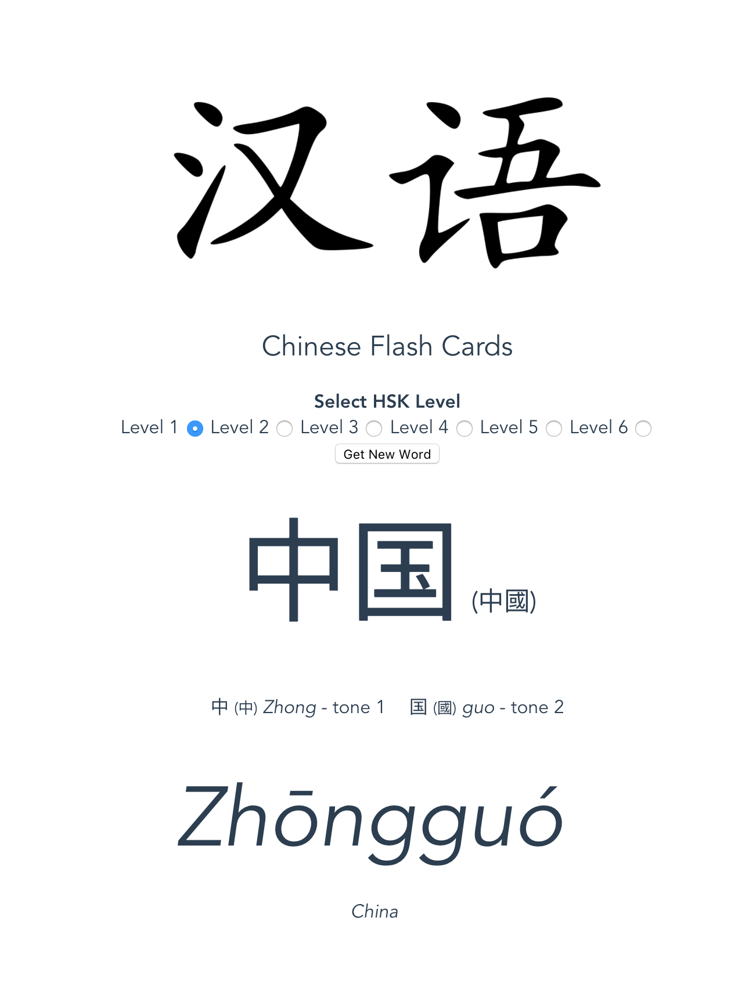

# HSK Flash Cards

A webapp for cycling through Mandarin words at different HSK levels. I imagine I will spend more time on this than actually learning Mandarin.

I'm also using this app as a learning experience for ES6, Koa, Vue.js, and Webpack.

For fun, I'm going to try to keep the client side JS as vanilla as possible, taking advantage of some of the newest pieces in WebAPI.

HSK Wordlists by level from: http://www.hskhsk.com/word-lists.html
